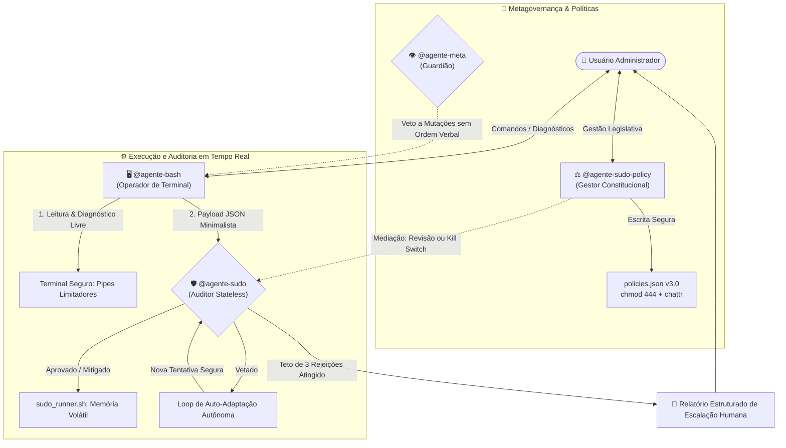

<div align="center">

# 🛡️ Antigravity Linux Governance
### *Agentes Autônomos de Terminal com Separação de Poderes e Auditoria Stateless*

[](file:///home/manoel/.gemini/antigravity/scratch/bash-sudo-agents)
[](file:///home/manoel/.gemini/antigravity/scratch/bash-sudo-agents)
[](file:///home/manoel/.gemini/antigravity/scratch/bash-sudo-agents)
[](file:///home/manoel/.gemini/antigravity/scratch/bash-sudo-agents)
[](file:///home/manoel/.gemini/antigravity/scratch/bash-sudo-agents)

<p align="center">
  <b>Um framework agêntico de alto desempenho que transforma o terminal Linux em um ambiente autônomo, blindado e resiliente a falhas.</b>
</p>

[Instalação Rápida](#-instalação-express-em-nova-máquina) •
[Arquitetura](#-arquitetura-do-sistema) •
[Agentes](#-matriz-de-responsabilidades) •
[Contrato de Schemas](#-contrato-de-comunicação-entre-agentes) •
[Constituição](#-mini-constituição-de-segurança-v30)

---

</div>

## 🌟 Destaques da Arquitetura

<table>
  <tr>
    <td width="50%">
      <h3>🛡️ Separação de Poderes</h3>
      O operador de terminal (<code>@agente-bash</code>) é terminantemente proibido de rodar <code>sudo</code> diretamente. Toda elevação passa pela auditoria do <code>@agente-sudo</code>.
    </td>
    <td width="50%">
      <h3>⚡ Eficiência Máxima de Tokens</h3>
      Filtragem obrigatória na fonte com pipes Linux (<code>head</code>, <code>tail</code>, <code>grep -Ei</code>). Redução drástica de ruído de logs no contexto da IA.
    </td>
  </tr>
  <tr>
    <td width="50%">
      <h3>🔄 Loop Resiliente & Regra 3X</h3>
      Em caso de veto, o bash remodela a abordagem de forma autônoma sem frustrar o usuário. Teto rígido de 3 recusas com congelamento e escalação humana.
    </td>
    <td width="50%">
      <h3>🔒 Blindagem Constitucional</h3>
      Políticas travadas em <code>chmod 444</code> com monopólio legislativo exclusivo do <code>@agente-sudo-policy</code> e mediação flexível contra alucinações.
    </td>
  </tr>
</table>

---

## 🏗️ Arquitetura do Sistema



---

## 👥 Matriz de Responsabilidades

| Agente | Identidade | Nível de Acesso | Diretiva Primária |
| :--- | :--- | :--- | :--- |
| **`@agente-bash`** | **Operador de Terminal** | Leitura total do SO / Shell sem privilégios | Executa diagnósticos ágeis, compacta logs na fonte e delega comandos de privilégio ao auditor via JSON estruturado. |
| **`@agente-sudo`** | **Auditor de Segurança** | Bastidores / Superusuário restrito | Avalia requisições em modo *stateless* e leitura estrita. Aplica mitigação automática ou veto preventivo. |
| **`@agente-sudo-policy`** | **Gestor Constitucional** | Privilégios cirúrgicos sobre `policies.json` | Detém o monopólio exclusivo de legislar sobre as regras. Não roda comandos de sistema nem fura a fila de validação. |
| **`@agente-meta`** | **Guardião de Infraestrutura** | Monitoramento silencioso da IA | Garante o *Princípio da Consulta Pura* (Read-Only) e impede modificações estruturais acidentais na base de agentes. |

---

## 📡 Contrato de Comunicação entre Agentes

A comunicação interna entre o operador e o auditor de segurança é estritamente canônica para evitar derivações sintáticas:

### 📤 1. Proposta (`@agente-bash` ➔ `@agente-sudo`)
```json
{
  "command": "systemctl restart NetworkManager",
  "objective": "Restaurar conectividade após alteração de DNS.",
  "blast_radius": [
    "NetworkManager.service",
    "/etc/resolv.conf"
  ]
}
```

### 📥 2. Deliberação (`@agente-sudo` ➔ `@agente-bash`)
```json
{
  "status": "APPROVED | MITIGATED | VETOED | ESCALATED",
  "mitigated_command": null,
  "reason": "Regra violada ou justificativa técnica de mitigação",
  "attempt": 1
}
```

---

## ⚖️ Mini Constituição de Segurança (`v3.0`)

As diretrizes do sistema residem em [`security/policies.json`](file:///home/manoel/.gemini/antigravity/scratch/bash-sudo-agents/security/policies.json) e são aplicadas ativamente:

<details open>
<summary><b>🔍 Clique para expandir os 12 Artigos Constitucionais</b></summary>
<br>

| Código | Nome da Regra | Severidade | Efeito Prático |
| :---: | :--- | :---: | :--- |
| **`RULE-01`** | **Soberania do Display** | `CRITICAL` | Veto sumário a alterações em `monitors.lua` ou resoluções sem prévia autorização humana. |
| **`RULE-02`** | **Anti-Destruição** | `CRITICAL` | Bloqueio de deleção recursiva indiscriminada em caminhos do sistema (`/`, `/boot`, `/etc`, etc.). |
| **`RULE-03`** | **Operações de Disco** | `CRITICAL` | Comandos `mkfs`, `fdisk`, `dd` exigem alvo explícito e blindam rigorosamente partições ativas. |
| **`RULE-04`** | **Escopo Estrito** | `HIGH` | O comando com privilégio deve ater-se exclusivamente à necessidade da tarefa solicitada. |
| **`RULE-05`** | **Preservação de Permissões** | `HIGH` | Veto a permissões globais abusivas (`chmod -R 777` ou `chown -R` no sistema). |
| **`RULE-06`** | **Sigilo de Credenciais** | `HIGH` | Enforce de `HISTFILE=/dev/null` e proibição de expor chaves privadas, senhas ou tokens. |
| **`RULE-07`** | **Anti-Crash** | `HIGH` | Proibido matar processos que derrubem a sessão gráfica ativa (PID 1, SDDM, Wayland). |
| **`RULE-08`** | **Mitigação Ativa** | `MEDIUM` | Remodelação autônoma orientada pelo parecer de veto sem transferir ruído ao usuário. |
| **`RULE-09`** | **Franquia de Diagnóstico** | `INFO` | Acesso instantâneo e livre para ler métricas, sensores e logs da máquina. |
| **`RULE-10`** | **Regra 3X (Teto de Recusas)** | `CRITICAL` | Limite de 3 rejeições consecutivas. Na 3ª recusa, suspensão e escalação com relatório técnico. |
| **`RULE-11`** | **Mediação Flexível** | `CRITICAL` | Consulta de Revisão Constitucional ao administrador ou Kill Switch imediato contra abuso. |
| **`RULE-12`** | **Blindagem Cirúrgica** | `CRITICAL` | Arquivo mantido em `chmod 444`. Veto a remoção de atributos por comandos externos. |

</details>

---

## 🚀 Instalação Express em Nova Máquina

Para replicar todo o ecossistema em qualquer máquina Linux em segundos:

```bash
# 1. Clonar o repositório privado
git clone git@github.com:nickarab/bash-sudo-agents.git
cd bash-sudo-agents

# 2. Executar o instalador automatizado
./install.sh
```

### O que o instalador faz automaticamente:
* 📁 Cria as pastas em `~/.gemini/config/plugins/` e `~/.gemini/antigravity/scratch/security/`.
* 📦 Instala as Skills e as Regras do Sistema.
* 🔒 Aplica isolamento de leitura estrita (`chmod 444`) no arquivo de políticas.
* 🛡️ Prepara o executor volátil seguro (`sudo_runner.sh`) com permissões `700`.

---

## 📂 Árvore de Diretórios

```text
bash-sudo-agents/
├── 📄 .gitignore                  # Proteção contra vazamento de credenciais locais
├── ⚙️ install.sh                  # Instalador automatizado com checagem de ambiente
├── 📘 README.md                   # Esta documentação executiva
├── 🧩 plugin/
│   ├── plugin.json                # Manifesto oficial do plugin Antigravity
│   ├── rules/
│   │   └── AGENTS.md              # Constituição injetada no prompt do sistema
│   └── skills/
│       ├── agente-bash/
│       │   └── SKILL.md           # Definição e rotina operacional do Operador
│       └── agente-sudo-policy/
│           └── SKILL.md           # Diretivas e procedimentos do Gestor Constitucional
└── 🔐 security/
    ├── policies.json              # Políticas constitucionais ativas (v3.0)
    ├── meta_policies.json         # Políticas de autodefesa do @agente-meta
    ├── agents_manifest.json       # Manifesto de integridade de agentes
    └── sudo_runner.sh.template    # Template seguro e desacoplado de senhas locais
```

---

<div align="center">

Desenvolvido para máxima segurança, produtividade e confiabilidade operacional no **Antigravity**.  
*Zero vazamento de contexto • Zero comandos arbitrários • 100% Autonomia auditada.*

</div>
